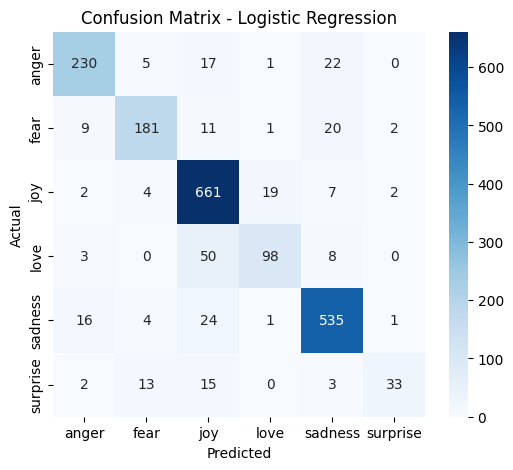

# Tweet_emotion-detector
# 🐦 Tweet Emotion Detector

This project classifies tweets into different **emotions** such as:
- 😀 Joy
- 😢 Sadness
- 😡 Anger
- 😍 Love
- 😱 Fear
- 😮 Surprise
- 😐 Neutral

It uses **machine learning (Naive Bayes & Logistic Regression)** with text preprocessing and **TF-IDF** features.

---

## 📂 Dataset
The dataset is taken from Kaggle: *Emotion Dataset for NLP*.  
It contains three files:
- `train.txt`
- `test.txt`
- `val.txt`

Each row has the format:

tweet;text_label

Example:

i didnt feel humiliated;sadness
i feel romantic too;love
i have immense sympathy;joy

---

## 🛠️ Workflow
1. **Preprocessing**  
   - Remove mentions (`@user`), hashtags, links, and punctuation  
   - Convert to lowercase  
   - Remove stopwords  

2. **Feature Extraction**  
   - Use **TF-IDF Vectorizer** to represent tweets as numerical vectors  

3. **Models Used**
   - Naive Bayes (MultinomialNB)  
   - Logistic Regression  

4. **Evaluation**
   - Accuracy  
   - Classification Report (Precision, Recall, F1-score)  
   - Confusion Matrix (heatmap)

---

## 📊 Results
- Both Naive Bayes and Logistic Regression perform well on text classification.  
- Confusion matrix visualizes which emotions are hardest to classify.  

*(Example — your results may differ)*  

Naive Bayes Accuracy: 0.83
Logistic Regression Accuracy: 0.87

Confusion Matrix (Logistic Regression):

---

## 🚀 How to Run
1. Open the notebook in Google Colab:  
   [Tweet Emotion Detector Notebook](https://colab.research.google.com/)  

2. Upload the dataset (`train.csv`, `test.csv`, `val.csv`).  

3. Run all cells (`Runtime → Run all`).  

4. The notebook will:
   - Preprocess the text  
   - Train models  
   - Show accuracy & confusion matrices  

---

## 📦 Tech Stack
- Python 🐍  
- Scikit-learn  
- Pandas  
- NLTK  
- Matplotlib & Seaborn  

---

## 📌 Deliverables
- Jupyter Notebook (`Tweet_Emotion_Detector.ipynb`)  
- Confusion Matrix Heatmap  
- README.md (this file)

---

✍️ *Made with ❤️ by [Ashu]*
